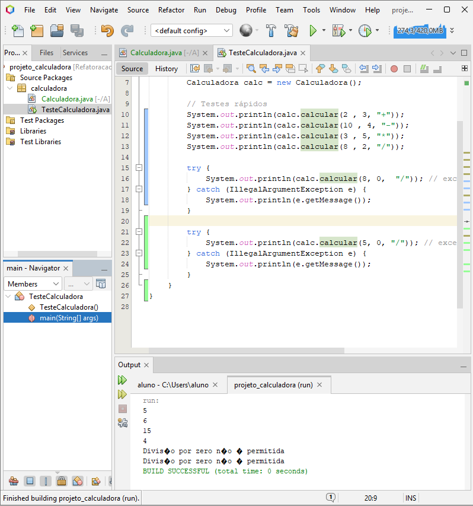

# Projeto Calculadora - Refatoração

Este projeto demonstra a aplicação
de práticas de clean code refatoração e Documentação com
Javadoc.

## Atividades realizadas 
1. Criação de código "Sujo" para base
2. Criação de testes unitarios.
3. Refatoração para métodos puros e
tratamento de exceções.
4. Geração de documentação Javadoc.

## Evidência de teste(Console)
Abaixo, o resultado da excução
da classe `TesteCalculadora´
demonstrando o sucesso nas
operações e a captura correta das exceções:

## Tecnologias
- Java
- NetBeans 
- Javadoc

